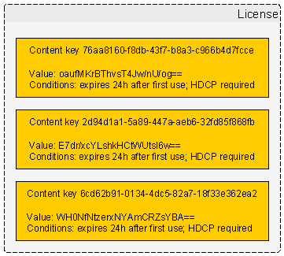
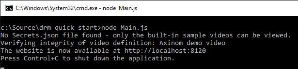
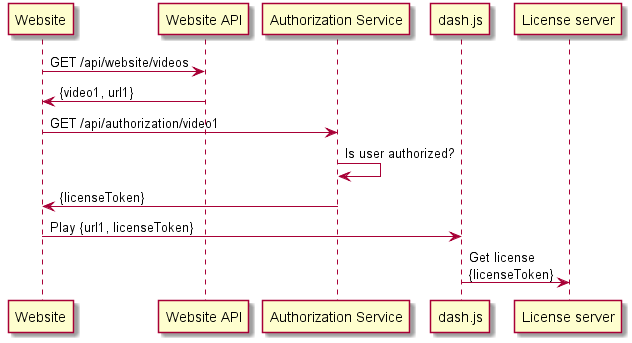
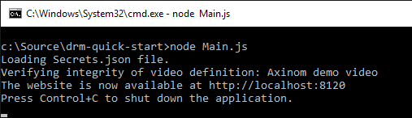

# Axinom DRM - quick start
This guide will show you how you can start using Axinom DRM to protect and play back premium video content.

TODO

It is structured in the following chapters:

1. An overview of modern DRM architecture.
1. Using a sample project with everything already set up.
1. Creating and protecting your own videos.
1. Customizing the DRM configuration.
1. Key management and security practices.

# Basic concepts of DRM

This chapter presents a high-level functional view of DRM concepts. Understand that there is a lot more happening under the covers, especially in the realm of security and key management.


The media samples in a protected video are encrypted with one or more **content keys**, each referenced in the video metadata by its unique key ID.



To play the video, a DRM-capable player needs to decrypt the media samples. For this, it needs access to the content keys, which are delivered in a **license** that also defines the conditions under which the content keys may be used (e.g. expiration).


The Axinom DRM **license server** will give a license to every player who can prove that they have the right to get a license. The player proves this by presenting a **license token** obtained from an **authorization service** whose responsibility it is to make such decisions and to obtain the appropriate content keys from the **key server**, attaching them in a secured form to the license token.

# Solution components and Axinom DRM

The Axinom DRM product suite includes both a license server and a key server, offered as cloud services. The remaining parts of a DRM-enabled solution must be either 3rd party products or custom developed components.

You will want to use a robust and reliable player that provides an optimal playback experience. [dash.js](https://github.com/Dash-Industry-Forum/dash.js) integrates natively with Axinom DRM and can be used in all modern browsers that contain a compatible content decryption module. On Android, [ExoPlayer](https://github.com/google/exoplayer) is the recommended player. The player ecosystem on other platforms is less straightforward - contact Axinom for detailed player evaluation guidance.

# Sample scenario 1: ready to go demo video

In the first scenario we explore, everything has been prepared for you - there exists a small website that has a single video that you can watch. All DRM information has been prepared for you and hardcoded into the application.

Follow the instructions below to run this sample project and go through the first sample scenario.

1. Install [node.js](https://nodejs.org) 
1. Clone or download this Git repository (the one that you are currently reading).
1. Open a terminal or command prompt window and go to the directory where you placed the repository's files (e.g. *C:\Source\drm-quick-start*).
1. Install required 3rd party packages by executing the following command: *npm install*
1. Run the application by executing the following command: *node Main.js*

1. If everything went well, the output from this command will instruct you to open [http://localhost:8120](http://localhost:8120) in your browser. Do so.

TODO: insert screenshot once website is less ugly

The first sample scenario is very simple - once you open the website, there is a single "Axinom demo video" link presented to you. Clicking on this link will play a protected video. That's it - go give it a try!

If you encounter any difficulties in getting the demo video to play, inspect the log messages shown in the browser's JavaScript console (F12) or in the terminal window.


## Understanding sample scenario 1

The sample project implements a basic website that enables the user to select a video and play it in a modern DRM-capable browser. By default, there is only a single Axinom demo video in the list but the later chapters will show you how to add more.

The main building blocks of the sample are:

* *Main.js* - creates an HTTP server that publishes the website, the website API and the authorization service.
* *VideoDatabase.js* - defines the list of videos made available to the user.
* *WebsiteApi.js* - implements the website API that is used by browser-side JavaScript code to obtain the list of videos.
* *AuthorizationServiceApi.js* - implements the authorization service API that makes authorization decisions when the browser-side JavaScript code requests permission to play back content; license tokens are provided by this API.
* *Website/Index.html* - the page loaded in the browser, including the browser-side JavaScript code; it communicates with the website API and the authorization service API using REST web service calls; the website plays videos using the dash.js player.



In terms of executed workflows, the following takes place:

1. When the website is loaded in a browser, the browser-side JavaScript code contacts the website API to retrieve the list of videos.
1. The website API simply returns whatever videos are listed in *VideoDatabase.js*. By default, there is just one video titled "Axinom demo video".
1. When the user clicks on a video link to start playback, the browser-side JavaScript code requests authorization from the authorization service API.
1. The authorization service will authorize every request, as there is no need to actually refuse playback in the sample scenarios. There are comments in the code indicating the location where actual authorization checking logic would go. 
1. If the website requested permission to play "Axinom demo video" then the authorization service simply returns a hardcoded license token. This is a special case to keep the first sample scenario very simple. Other scenarios introduced below will use a more realistic workflow. 
1. Upon receiving the license token, the browser-side JavaScript code will activate dash.js and instruct it to play the video, providing both the video URL and the DRM configuration.
1. The player detects that the video is protected and takes care of any further DRM logic and license server communication.

The code is thoroughly commented, so the above is only a high-level overview. To understand the details, explore the source code!

# Sample scenario 2: creating your own license tokens

In this scenario, we will modify the sample project to generate a unique license token upon every request, instead of returning a hardcoded license token.

You will need an [Axinom DRM evaluation account](http://drm.axinom.com/evaluation-account/) in order to proceed. Upon signing up, you will receive a document titled "Axinom DRM Fact Sheet" that will contain some information required below.

To modify the project for the second sample scenario, open *VideoDatabase.js* and remove the hardcoded license token from "Axinom demo video", replacing it with a `keys` list that matches the data shown below.

```
 {
    "name": "Axinom demo video",
    "url": "http://media.axprod.net/TestVectors/v6-MultiDRM/Manifest_1080p.mpd",
    "keys": [
        {
            "keyId": "6e5a1d26-2757-47d7-8046-eaa5d1d34b5a",
            "key": "GX8m9XLIZNIzizrl0RTqnA=="
        }
    ]
}
``` 

Now, create a file *Secrets.json* based on the sample below and place it in the same directory as *Main.js*. **Replace the example data below with real values from the Axinom DRM Fact Sheet**.

```
{
    "communicationKeyId": "cffd95ba-aada-445b-b4ad-e8f322cf576a",
    "communicationKey": "092B1EFD61770602833E1621451A99092B1EFD61770602833E1621451A999999"
}
```

Having created the *Secrets.json* file, you should see a message about it being loaded when you start the application.



That's all you need! The authorization service will now generate a unique license token upon every request. Run the application, open the website in a browser and go play the video!

If you encounter any difficulties in getting the demo video to play, inspect the log messages shown in the browser's JavaScript console (F12) or in the terminal window.

## Understanding sample scenario 2

The logic for generating license tokens is already provided in *AuthorizationServiceApi.js* and this functionality is activated by the instructions above. In order to generate a license token, the authorization service needs to know the IDs and values of all keys that are to be made available to the user.

*Note: this pattern of key management is simplified compared to actual production use. See the chapter on security below.* 

The **communication key** secures the transfer of sensitive data (content keys) from the authorization service to the license server and authenticates the license token, making it impossible to forge. See the code in *AuthorizationServiceApi.js* to understand the details. 

# Sample scenario 3: creating your own videos

# Sample scenario 4: enforcing content owner protection policies

# Security omissions in sample code

To keep the sample code simple and straightforward, many critical website security measures are omitted (e.g. mandatory HTTPS, CSRF protection, any actual login/authentication). This is intentional, as the goal of the sample is to showcase interactions with Axinom DRM and the security of the website itself is not in focus.

Furthermore, key management practices are deliberately simplified and the content keys are exposed to the authorization service. This is normally not acceptable from a security standpoint, as the content keys should only be visible to the key server and the license server in a production scenario.