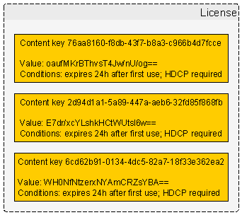
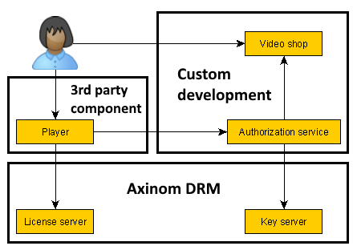
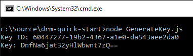
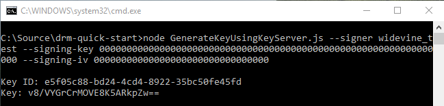

# Axinom DRM - quick start
This guide will show you how you can start using Axinom DRM to protect and play back premium video content.

Axinom DRM offers multiple DRM technologies - FairPlay Streaming, PlayReady and Widevine Modular. Due to contractual limitations regarding the evaluation of FairPlay, however, this guide focuses on how to get started with PlayReady and Widevine Modular. [Contact Axinom](mailto:info@axinom.com) to get started with FairPlay Streaming.

A separate repository also contains an [Android frontend](https://github.com/Axinom/drm-quick-start-android) that interoperates with this sample project.

# Basic concepts of DRM

This chapter presents a high-level functional view of DRM concepts. Understand that there is a lot more happening under the covers, especially in the realm of security and key management.


The media samples in a protected video are encrypted with one or more **content keys**, each referenced in the video metadata by its unique key ID.



To play the video, a DRM-capable player needs to decrypt the media samples. For this, it needs access to the content keys, which are delivered in a **license** that also defines the conditions under which the content keys may be used (e.g. expiration).


The Axinom DRM **license server** will give a license to every player who can prove that they have the right to get a license. The player proves this by presenting a **license token** obtained from an **authorization service** whose responsibility it is to make such decisions and to obtain the appropriate content keys from the **key server**, attaching them in a secured form to the license token.

# Solution components and Axinom DRM

The Axinom DRM product suite includes both a license server and a key server, offered as cloud services. The remaining parts of a DRM-enabled solution must be either 3rd party products or custom developed components. The diagram below illustrates the most common setup.



You will want to use a robust and reliable player that provides an optimal playback experience. [dash.js](https://github.com/Dash-Industry-Forum/dash.js) integrates natively with Axinom DRM and can be used in all modern browsers that contain a compatible content decryption module. On Android, [ExoPlayer](https://github.com/google/exoplayer) is the recommended player. The player ecosystem on other platforms is less straightforward - [Contact Axinom](mailto:info@axinom.com) for detailed player evaluation guidance.

# Sample scenario 1: ready to go demo video

In the first scenario we explore, everything has been prepared for you - there exists a small website that has a single video that you can watch. All DRM information has been prepared for you and hardcoded into the application.

The supported browsers for this sample app are Google Chrome, Mozilla Firefox, Microsoft Edge and Microsoft Internet Explorer. Only the latest version of each browser is supported.

Follow the instructions below to run this sample project and go through the first sample scenario.

1. Install [node.js](https://nodejs.org) 
1. Clone or download this Git repository (the one that you are currently reading).
1. Open a command prompt window and go to the directory where you placed the repository's files (e.g. *C:\Source\drm-quick-start*).
1. Install required 3rd party packages by executing the following command: *npm install*
1. Run the application by executing the following command: *node Server.js*

1. If everything went well, the output from this command will instruct you to open [http://localhost:8120](http://localhost:8120) in your browser. Do so.

The first sample scenario is very simple - once you open the website, there is a single "Axinom demo video" link presented to you. Clicking on this link will play a protected video. That's it - go give it a try!


If you encounter any difficulties in getting the demo video to play, inspect the log messages shown in the browser's JavaScript console (F12) and in the command prompt window.


## Understanding sample scenario 1

The sample project implements a basic website that enables the user to select a video and play it in a modern DRM-capable browser. By default, there is only a single Axinom demo video in the list but the later chapters will show you how to add more.

The main building blocks of the sample are:

* *Server.js* - creates an HTTP server that publishes the website, the catalog API and the authorization service.
* *VideoDatabase.js* - defines the list of videos made available to the user.
* *CatalogApi.js* - implements the catalog API that is used by browser-side JavaScript code to obtain the list of videos.
* *AuthorizationServiceApi.js* - implements the authorization service API that makes authorization decisions when the browser-side JavaScript code requests permission to play back content; license tokens are provided by this API.
* *Website/Index.html* - the page loaded in the browser, including the browser-side JavaScript code; it communicates with the catalog API and the authorization service API using REST web service calls; the website plays videos using the dash.js player.


In terms of executed workflows, the following takes place:

1. When the website is loaded in a browser, the browser-side JavaScript code contacts the catalog API to retrieve the list of videos.
1. The catalog API simply returns whatever videos are listed in *VideoDatabase.js*. By default, there is just one video titled "Axinom demo video".
1. When the user clicks on a video link to start playback, the browser-side JavaScript code requests authorization from the authorization service API.
1. The authorization service will authorize every request, as there is no need to actually refuse playback in the sample scenarios. There are comments in the code indicating the location where actual authorization checking logic would go. 
1. If the website requested permission to play "Axinom demo video" then the authorization service simply returns a hardcoded license token. This is a special case to keep the first sample scenario very simple. Other scenarios introduced below will use a more realistic workflow. 
1. Upon receiving the license token, the browser-side JavaScript code will activate dash.js and instruct it to play the video, providing both the video URL and the DRM configuration.
1. The player detects that the video is protected and takes care of any further DRM logic and license server communication.

The code is thoroughly commented, so the above is only a high-level overview. To understand the details, explore the source code!

# Sample scenario 2: creating your own license tokens

In this scenario, we will modify the sample project to generate a unique license token upon every request, instead of returning a hardcodedg license token.

You will need an [Axinom DRM evaluation account](http://drm.axinom.com/evaluation-account/) in order to proceed. Upon signing up, you will receive a document titled "Axinom DRM Fact Sheet" that will contain some information required below.

To modify the project for the second sample scenario, open *VideoDatabase.js* and remove the hardcoded license token from "Axinom demo video", replacing it with a `keys` list that matches the data shown below.

```
 {
    "name": "Axinom demo video",
    "url": "https://media.axprod.net/TestVectors/v6-MultiDRM/Manifest_1080p.mpd",
    "keys": [
        {
            "keyId": "6e5a1d26-2757-47d7-8046-eaa5d1d34b5a",
            "key": "GX8m9XLIZNIzizrl0RTqnA=="
        }
    ]
}
``` 

Now, create a file *Secrets.json* based on the sample below and place it in the same directory as *Server.js*. **Replace the example data below with real values from the Axinom DRM Fact Sheet**.

```
{
    "communicationKeyId": "cffd95ba-aada-445b-b4ad-e8f322cf576a",
    "communicationKey": "092B1EFD61770602833E1621451A99092B1EFD61770602833E1621451A999999"
}
```

Having created the *Secrets.json* file, you should see a message about it being loaded when you start the application.


That's all you need! The authorization service will now generate a unique license token upon every request. Run the application, open the website in a browser and go play the video!

If you encounter any difficulties in getting the demo video to play, inspect the log messages shown in the browser's JavaScript console (F12) and in the command prompt window.

## Understanding sample scenario 2

The logic for generating license tokens is already provided in *AuthorizationServiceApi.js* and this functionality is activated by the instructions above. In order to generate a license token, the authorization service needs to know the IDs and values of all keys that are to be made available to the user.

*Note: this pattern of key management is simplified compared to actual production use. See the chapter on security below.* 

The **communication key** secures the transfer of sensitive data (content keys) from the authorization service to the license server and authenticates the license token, making it impossible to forge. See the code in *AuthorizationServiceApi.js* to understand the details. 

# Sample scenario 3: creating your own videos

In this scenario, we will modify the sample project to play back videos that you create. *As a prerequisite, you must already have performed the sample project modifications described in sample scenario 2*.

One package available to you in the Axinom DRM customer portal is a command-line utility called *Makemedia*. This is a reference encoder and media processing utility made available to you for use in evaluation scenarios. You will need to download this utility in order to proceed.

Makemedia system requirements:
* 64-bit Windows operating system (Windows 10 recommended)
* .NET Framework 4.6 or newer

**The starting point for this scenario is an MP4 or MOV file containing both video and audio** - ensure that your video is in this format before continuing. You can download some free test content in this format from the [Blender Foundation](https://mango.blender.org/download/). The steps below will transform this input video into a format suitable for playback.

Before you can do anything with the video, you will need to generate a content key. The sample project includes two simple command line applications for generating a random content key either locally or via the Axinom Key Server, based on customer's default Key Seed:

* *GenerateKey.js* - generates a random content key on local PC. To use it, execute the following command in the project directory: *node GenerateKey.js* 

   

* *GenerateKeyUsingKeyServer.js* - generates a content key using Axinom Key Server, based on customer's default Key Seed. To use it, execute the following command in the project directory, while replacing parameter values with the ones specified in the "Key Server" section of your Axinom DRM Fact Sheet: *node GenerateKeyUsingKeyServer.js --signer `Account name` --signing-key `64-character hex Signing Key` --signing-iv `32-character hex Signing IV`* 

   

Now you are ready to start creating the video. Open a command prompt window and go to the location where you saved the Makemedia utility. There, execute the following command, replacing the parameter values with your own: *Makemedia.exe --input C:\path\to\your\video.mp4 --output C:\source\drm-quick-start\Website\Video1 --keyid 60447277-19b2-4367-a1e0-da543aee2da0 --key DnfNa6jat32yHlWbwnt7zQ==*


Wait for the video to be encoded, encrypted and packaged. This may take up to 24 hours for full-length movies, though only minutes for short clips.

The output location will have two subdirectories: *Clear* and *Encrypted*. For diagnostic and troubleshooting purposes, a clear variant (without encryption) of your video is generated side-by-side with the encrypted variant.


The sample project website will correctly serve DASH videos if the output files are placed under the *Website* directory, as in the above example. You may also use external servers but as web servers require some configuration in order to correctly serve videos, using the sample project is the easiest option to start with.

Having created the video, add the relevant entry to *VideoDatabase.js*. You need to provide the name, the URL to the *Encrypted/Manifest.mpd* file and the details of the key used to encrypt the video.

```
{
    "name": "My video 1",
    "url": "http://localhost:8120/Video1/Encrypted/Manifest.mpd",
    "keys": [
        {
            "keyId": "60447277-19b2-4367-a1e0-da543aee2da0",
            "key": "DnfNa6jat32yHlWbwnt7zQ=="
        } 
    ]
},
```

That's it! You can now start the application, open the website and play your video!

If you encounter any difficulties in getting the demo video to play, inspect the log messages shown in the browser's JavaScript console (F12) and in the command prompt window.

Follow the same process to play videos created with 3rd party tools. As each media processing product operates differently, universal instructions cannot be provided here. [Contact Axinom](mailto:info@axinom.com) for detailed support in setting up your media workflows.

# Moving onward to real-world usage

To keep the sample code simple and straightforward, various omissions and simplifications have been made. The following additional aspects need to be considered when planning a real-world deployment using Axinom DRM:

* The authorization service shown here authorizes every user for every playback request. If this does not match your business scenario, you need to create the relevant checks that ensure license tokens are only granted to viewers who are authorized to play back the content. 
* Your website or client app must use HTTPS in order to protect against the interception of communications (e.g. to steal the license token generated by the authorization service).
* You must carefully plan the life cycle of license tokens to match your business scenario. While the sample project requests a license token immediately before playback, this need not always be so. Some scenarios may benefit from long-lived license tokens generated well in advance of playback, thereby reducing network traffic for authorization checks. On the other hand, long-lived license tokens enable a greater degree of misuse if they are ever stolen; short 5-minute license tokens enable a stricter level of control for scenarios where that is a concern.
* In a high-security production scenario, it is not desirable for the authorization service to have access to content keys. Instead, only the Axinom key server and Axinom license server should possess the content keys, with the authorization service embedding them into the license token using an encrypted key container. The relevant interactions are currently not demonstrated by this sample project.
* Content owners may require you to use different keys for different tracks and quality levels, though this is usually only required when working with very high value content (e.g. Ultra-HD or 4K video). Ensure that your content production workflow is capable of this. 

[Contact Axinom](mailto:info@axinom.com) for detailed support in setting up your production deployment.
