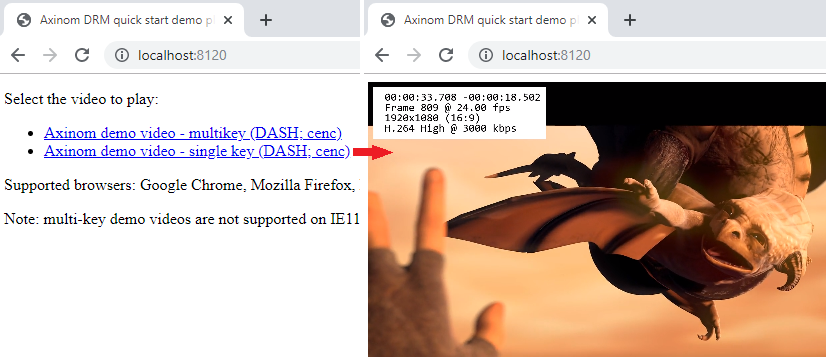

# Axinom DRM - quick start

This guide will show you how you can start using Axinom DRM to protect and 
play back premium video content. 

The DRM technologies offered by Axinom are: 
* Google Widevine 
* Microsoft PlayReady 
* Apple FairPlay Streaming

A separate repository also contains a simple implementation of an
[Android frontend](https://github.com/Axinom/drm-quick-start-android) and 
[iOS frontend](https://github.com/Axinom/drm-quick-start-ios) that 
interoperate with this sample project.

# Axinom DRM overview

This chapter presents the basic concepts of DRM and provides a high-level 
overview of a common Axinom DRM usage workflow that is further demonstrated in 
the following chapters. For more in-depth information about the involved 
processes and guidance on choosing a workflow best suited for your business 
needs 
[Contact Axinom](mailto:info@axinom.com).

## Content protection

The first phase in the use of DRM is the preparation of DRM-protected content. 
This is illustrated by the following diagram:


1. Clear (unencrypted) content is provided to a DRM-capable encoder / packager.
1. The encoder / packager contacts Axinom DRM Key Service and requests one or 
more content keys (content encryption keys). 
1. The key service generates new keys and returns them securely to the 
encoder / packager, together with the key IDs.
1. The encoder / packager uses the key information to encrypt the content and 
package it in a format suitable for DRM-enabled adaptive streaming, and uploads 
the output to an origin server.

## Protected content playback

The second phase is the playback of DRM-protected content. To play a video, a 
DRM-capable player needs to decrypt the media. For this, it needs access to 
the content keys, which are delivered in a **license** that also defines the 
conditions under which the content keys may be used (e.g. expiration). Licenses 
are generated by **Axinom DRM License Service** when a player sends the 
license service a **license request** together with a **license token**. 
The license token proves that the player has the right to get a license and 
instructs the license service how to configure and generate the license.

This process is illustrated by the following diagram:


1. An end-user chooses a video in a media player's playlist and initiates 
playback.
1. The player requests the content from a content delivery network (CDN).
1. Encrypted content is streamed from the CDN to the player.
1. The player notices the stream is protected by DRM and prepares for license 
acquisiton by obtaining a license request (from a Content Decryption Module, 
or CDM, integrated into the playback platform) based on the media metadata and 
requests a license token from a Secure Token Service.
1. The Secure Token Service authenticates the end-user and generates a license 
token configured according to the content manager's business rules. 
1. The player then sends the license request, together with the license token, 
to the license service.
1. License service authenticates the license token and generates a license 
(according to the information in the license token), which is then returned 
to the player.
1. Playback starts (provided that the content keys are valid and playback 
rules are satisfied).

## Solution components

The core Axinom DRM products are Axinom DRM Key Service and Axinom DRM License 
Service. Both are offered as cloud services while Axinom DRM License Service 
is also available as an on-premises installation.

The remaining parts of a DRM-enabled solution must be composed of additional 
Axinom or 3rd party products, or custom-developed components.

In terms of freely available 3rd party playback applications, we recommend the
following robust and reliable players:
* [Shaka Player](https://github.com/google/shaka-player)
* [dash.js](https://github.com/Dash-Industry-Forum/dash.js)
* [ExoPlayer](https://github.com/google/exoplayer) (Android) 

The player ecosystem on other platforms is less straightforward - 
[Contact Axinom](mailto:info@axinom.com) for assistance in player selection 
and integration.

# Sample scenario 1: ready to go demo video

In the first scenario everything has been prepared for you - there exists a 
small website with an integrated player and a couple of DRM-protected demo 
videos that you can watch. All necessary DRM information is hardcoded into 
the application.

The sample application can be used with the latest versions of the following 
browsers (the DRMs supported are in parentheses): 
* Google Chrome (Widevine)
* Mozilla Firefox (Widevine) 
* Microsoft Edge (PlayReady and Widevine)
* Microsoft Internet Explorer (PlayReady)
* Apple Safari (FairPlay)

Please follow the instructions below to run this sample project and go through 
the first sample scenario.

1. Install [node.js](https://nodejs.org) 
1. Clone or download this Git repository (the one that you are currently 
reading).
1. Open a command prompt window and go to the directory where you placed the 
repository's files (e.g. *C:\Source\drm-quick-start*).
1. Install required 3rd party packages by executing the following command: 
    ```
    npm install
    ```
1. Run the application by executing the following command: 
    ```
    node Server.js
    ```
    
    

1. If everything went well, the output from this command will instruct you to 
open [http://localhost:8120](http://localhost:8120) in your browser. Do so.
1. Open the website and click one of the links: the selected protected demo video will play.



If you encounter any difficulties in getting the demo videos to play, inspect 
the log messages shown in the browser's JavaScript console and in the command 
prompt window.


## Understanding sample scenario 1

The sample project implements a basic website that enables the user to select 
a video and play it in a modern DRM-capable browser. By default, there are 
only a few demo videos in the list but the later chapters will show you how to 
add more.

The main building blocks of the sample are:

* *Server.js* - creates an HTTP server that publishes the website, the catalog 
API and the Secure Token Service.
* *VideoDatabase.js* - defines the list of videos made available to the user.
* *CatalogApi.js* - implements the catalog API that is used by browser-side 
JavaScript code to obtain the list of videos.
* *SecureTokenService.js* - implements the Secure Token Service - an API that 
authorizes playback requests coming from the browser-side JavaScript code and 
returns license tokens. 
* *Website/index.html* - the page loaded in the browser, including the 
browser-side JavaScript code; it communicates with the catalog API and the 
token service using REST web service calls; the website integrates Shaka 
Player for video playback.


In terms of executed workflows, the following takes place:

1. When the website is loaded in a browser, the browser-side JavasScript code 
first determines whether the browser supports FairPlay. 
1. If FairPlay is supported, then the Axinom FairPlay Test Certificate is 
loaded from an Axinom server and the integrated player is configured for 
FairPlay use.
1. Catalog API is contacted to retrieve the list of videos. 
1. Catalog API returns the videos listed in *VideoDatabase.js*. The demo 
videos are filtered by tags to only show those playable on the current 
browser.
1. When the user clicks on a video link to start playback, the following will 
take place.
1. The browser-side JavaScript code requests a license token from the Secure 
Token Service. In production, this service should also authorize the user.
1. The token service grants a token for every request, as there is no need to 
actually refuse playback in the sample scenarios. If the website requested 
permission to play one of the pre-defined videos then the authorization service 
simply returns a hardcoded license token (this is a special case to keep the 
first sample scenario simple); other scenarios introduced below will use a 
more realistic workflow, where a new token is generated upon each request.
1. Upon receiving the license token, the browser-side JavaScript code 
activates the embedded Shaka Player and instruct it to play the video, 
providing both the video URL and the DRM configuration. For the rest of the 
process, the player code will be in control.
1. The player detects that the video is protected and requests a license from 
the license service, while also attaching the license token to the request.
1. License service authorizes the license token and returns a license based on 
the information in the token.
1. Playback starts (provided that the content keys in the license are correct 
and playback rules are met).

The code is thoroughly commented, so the above is only a high-level overview. 
To understand the details, please explore the source code.

# Sample scenario 2: creating your own license tokens

In this scenario, sample project is going to be modified to generate a unique 
license token upon every request, instead of returning a hardcoded one.

[Axinom DRM evaluation account](http://drm.axinom.com/evaluation-account/) is
needed in order to proceed. Upon signing up, you will receive a document 
titled "Axinom DRM Service Fact Sheet" that will contain information required 
below.

To modify the project for the second sample scenario: 
1. Open *VideoDatabase.js* and pick one of the pre-made video entries, which 
is going to be modified and worked with for the rest of this scenario. 

1. Depending on your browser, choose one of the following: 
    * On Safari: "Axinom demo video - single key (HLS; cbcs)"
    * Other browsers: "Axinom demo video - single key (DASH; cenc)"

1. Remove the hardcoded license token from the video and replace it with the 
following `keys` list:
    ```
        "keys": [
            {
                "keyId": "211ac1dc-c8a2-4575-baf7-fa4ba56c38ac"
            }
        ]
    ```

1. Create a *Secrets.json* file based on the sample below and place it in 
the same directory as *Server.js*. **Replace the communication key below with 
real values from the Axinom DRM Fact Sheet**. 
    ```
    {
        "communicationKeyId": "00000000-0000-0000-0000-000000000000",
        "communicationKey": "00000000000000000000000000000000000000000w=="
    }
    ```

    The **communication key** is used to digitally sign license tokens and 
    secure the transfer of sensitive data. The signature will be checked by 
    the license service to authenticate the token and to verify its integrity, 
    making the token impossible to forge. See the comments in 
    *SecureTokenService.js* for more details.

    Having created the *Secrets.json* file, you should see a message about it 
    being loaded when you start the application.

    

    From now on the token service will generate a unique license token upon 
    every request for videos not using a hardcoded token. 

1. Run the application, open the website in a browser and go play the video!

If you encounter any difficulties in getting the demo video to play, inspect 
the log messages shown in the browser's JavaScript console and in the command 
prompt window.

## Understanding sample scenario 2

The logic for generating license tokens is already provided in 
*SecureTokenService.js* and this functionality is activated by the 
instructions above. In order to generate a license token, the token service 
needs to know the IDs of all content keys that are to be made available to 
the user. 

*Note: this pattern of key management is simplified compared to actual 
production use. See the chapter on security below.* 

# Sample scenario 3: creating your own videos

In this scenario the sample project is going to be modified to play back 
videos that you create. 

To proceed, please ensure that the following prerequisites are fulfilled:
* The sample project modifications described in scenario 2 are already 
performed.

* *Makemedia*, a command-line encoder and media processing utility, is 
downloaded from the Axinom DRM customer portal. This is a reference encoder 
and media processing utility made available to you for use in evaluation 
scenarios. 
    * Makemedia system requirements:
        * 64-bit Windows operating system (Windows 10 recommended)
        * .NET Framework 4.6 or newer

* Ensure that you have an MP4 or MOV file containing both video and audio. 
You can download some free test content in this format from the 
[Blender Foundation](https://mango.blender.org/download/). During initial 
experimentation it is recommended to start out with short clips to reduce 
media processing time.

The steps below will transform this your video file into a format suitable 
for playback:

1. Before you do anything with the video, you will need to generate a content 
key. The sample project includes a simple command line-application, 
*GenerateKeyUsingKeyService.js*, for generating a content key using Axinom DRM 
Key Service, based on your default key seed. To use it, execute the 
following command in the project directory, while replacing parameter values 
with the ones specified in the "Key Service" section of your Axinom DRM Fact 
Sheet:
    
    ```
    node GenerateKeyUsingKeyService.js --signer <Provider Name> --signing-key <64-character hex Signing Key> --signing-iv <32-character hex Signing IV>
    ```

    

1. Now you are ready to start creating the video. Open a command prompt window 
and go to the location where you saved the Makemedia utility. There, execute 
the following command, replacing the parameter values with your own: 

    ```
    Makemedia.exe --input C:\path\to\your\video.mp4 --output C:\source\drm-quick-start\Website\Video1 --avc --keyid 60447277-19b2-4367-a1e0-da543aee2da0 --key DnfNa6jat32yHlWbwnt7zQ==
    ```

    

    Above command will create H264 CMAF content with CENC and CBCS encryption, 
    together with DASH and HLS manifests: 
    * All DASH content will contain Widevine and PlayReady signalling. 
    * HLS-CBCS content will contain both FairPlay and Widevine signalling.
    * HLS-CENC content will contain Widevine signalling.
    
1. Wait for the video to be encoded, encrypted and packaged. This may take up 
to 24 hours for full-length movies, though only minutes for short clips. 

    The output location will have three subdirectories: *Clear*, 
    Encrypted_Cenc* and *Encrypted_Cbcs*. The clear variant is generated for 
    diagnostic and troubleshooting purposes. If you wish to omit it, add 
    *--noclear* attribute to the command.

    

    The sample project website will correctly serve videos if the output files 
    are placed under the *Website* directory, as in the above example (it's 
    possible to use external servers but as web servers require some 
    configuration in order to correctly serve videos, using the sample project 
    is the easiest option to start with).

1. Having created the video, add a matching entry to *VideoDatabase.js*. You 
need to provide a video name, the URL to one of the manifest files and the Key 
ID used in encrypting the video. 

    ```
    {
        "name": "My video 1",
        "url": "http://localhost:8120/Video1/Encrypted_Cenc/Manifest.mpd",
        "keys": [
            {
                "keyId": "60447277-19b2-4367-a1e0-da543aee2da0"
            } 
        ]
    }
    ```

    Note: when evaluating FairPlay, e.g. on Safari, use the URL of the 
    HLS-CBCS manifest (*Encrypted_Cbcs/Manifest.m3u8*); otherwise use the 
    DASH-CENC manifest (*Encrypted_Cenc/Manifest.mpd*).

1. That's it! You can now start the application, open the website and play 
your video!

If you encounter any difficulties in getting the demo video to play, inspect 
the log messages shown in the browser's JavaScript console and in the command 
prompt window.

Follow the same process to play videos created with 3rd party tools. As each 
media processing product operates differently, universal instructions cannot 
be provided here. [Contact Axinom](mailto:info@axinom.com) for detailed 
support in setting up your media workflows.

# Sample scenario 4: creating your own multi-key videos

When working with high-value content, content owners may require the usage of 
different keys for different tracks and quality levels. 

Current scenario, very similar to the previous 3rd scenario, demonstrates how 
to prepare multi-key content. It will use Makemedia to create multi-key 
content similar to the predefined "multikey" demo videos in 
*VideoDatabase.js*, where the FHD and HD tracks (1080p and 720p), SD tracks 
(480p, 360p and 288p) and the audio track are encrypted with different keys. 

In order to proceed, please ensure that the following prerequisites are 
fulfilled:
* Scenario 3 is completed and understood.
* Make sure the input video has at least 720p resolution. Otherwise HD-track 
specific keys cannot be applied, and your content will end up being encrypted 
with fewer different keys.

Steps for multi-key content preparation:

1. Generate three separate key/key ID pairs by running the previously 
introduced *GenerateKeysUsingKeyService.js* script three times.  

1. For multi-key content generation, Makemedia requires a CPIX (Content 
Protection Information Exchange) document as input, which allows you to map 
content keys to different tracks. Thorough CPIX knowledge or specialty tools 
are not needed for this scenario. Just open the 
[reference CPIX document](Resources/AxinomDemoVideo-MultiKey.xml) in a text 
editor and replace all content keys and their IDs with the ones that you just 
generated and save the document.

    For more information on CPIX, refer to 
    [CPIX documentation](https://dashif.org/docs/CPIX2.2/Cpix.html). You 
    may also take a look at the .NET [Axinom CPIX library](https://github.com/Axinom/cpix).

1. Now you are ready to create the multi-key video. You can use the same input 
video as in scenario 3. Open a command prompt window, go to the location 
where you saved the Makemedia utility and execute the following command, 
replacing the parameter values with your own: 

    ```
    Makemedia.exe --input C:\path\to\your\video.mp4 --output C:\source\drm-quick-start\Website\Video2 --avc --cpix="C:\source\drm-quick-start\Resources\AxinomDemoVideo-MultiKey.xml"
    ```

    

1. Wait for the video to be processed. When finished, the output location will 
have similar contents as in scenario 3. However, if you open the HLS or DASH 
manifests of the encrypted content with a text editor, you'll notice that now 
different tracks are associated with different content key IDs.

1. Add a matching entry to *VideoDatabase.js*, similarly to scenario 3. 
The only difference is that this time multiple Key IDs need to be 
specified - all three that were used in the encryption of this video. 

    ```
    {
        "name": "My video 2",
        "url": "http://localhost:8120/Video2/Encrypted_Cenc/Manifest.mpd",
        "keys": [
            {
                "keyId": "f3d588c7-c17a-4033-9035-8db317390be6"
            },
            {
                "keyId": "44b18a32-6d36-499d-8b93-a20f948ac5f2"
            },
            {
                "keyId": "ae6e87e2-3c3c-46d1-8e9d-ef4c461d4681"
            }, 
        ]
    }
    ```

    Note: when evaluating FairPlay, e.g. on Safari, use the URL of the 
    HLS-CBCS manifest (*Encrypted_Cbcs/Manifest.m3u8*); otherwise use the 
    DASH-CENC manifest (*Encrypted_Cenc/Manifest.mpd*).

1. That's it! Start the application, open the website and play your 
multi-key video.

# Moving onward to real-world usage

In a real-world scenario there are potentially many more aspects to consider. 

* Axinom DRM License Service and Key Service are highly flexible and can 
accommodate to a wide range of scenarios:

    * Axinom DRM can work in different modes - it supports working with key 
    seeds as well as individual keys.

    * Axinom DRM Key Service supports several key delivery protocols out of 
    the box, including AWS SPEKE and Google Widevine Common Encryption API

    * Axinom has complementary offerings that can help create a comprehensive 
    video streaming solution: Axinom VIP - for encoding / packaging, Axinom 
    Player SDK - for secure playback, and Axinom CMS - for managing content.

* To keep the sample code straightforward, simplifications have been made. 
The following additional aspects should be considered when planning a 
real-world deployment:

    * The Secure Token Service shown here authorizes every user for every 
    playback request and produces tokens with very relaxed playback 
    restrictions. Adjust this behaviour according to your business needs, so 
    that only the intended users can play back content under intended terms.

    * Your website or client app should use HTTPS in order to protect against 
    the interception of communications (e.g. to steal the license token 
    generated by the token service). Also, if your website/player is not 
    served on localhost, it must be accessed using HTTPS to enable DRM 
    playback.

    * You must carefully plan the life cycle of license tokens to match your 
    business scenario. While the sample project requests a license token 
    immediately before playback, this need not always be so. Some scenarios 
    may benefit from long-lived license tokens generated well in advance of 
    playback, thereby reducing network traffic. On the other hand, long-lived 
    license tokens enable a greater degree of misuse if they are ever stolen; 
    short 5-minute license tokens enable a stricter level of control for 
    scenarios where that is a concern.

[Contact us](mailto:info@axinom.com) to learn more about our offerings and to 
get support in setting up your production environment.